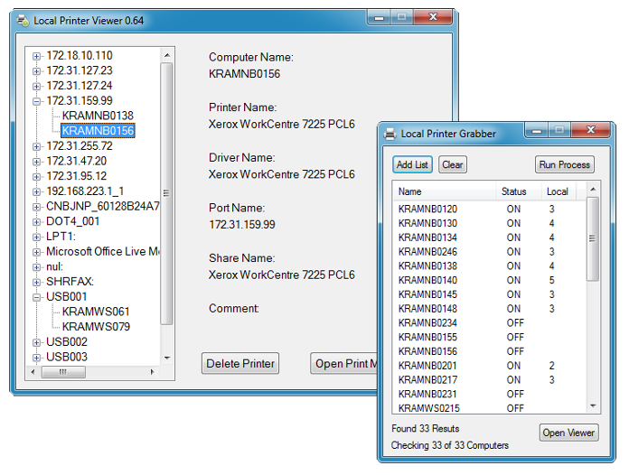

# LocalPrinterSuite
 10/JAN/2017 - This tool is useful if you want to check multiple systems and view/remove their locally installed printers over a network.

Simply load up the grabber and open a list of systems for it to check, it will then scan each one and collect the locally installed printers.
You can then load up the viewer and see what is installed to ensure it matches with what you expect and remove any that might be causing issues.

